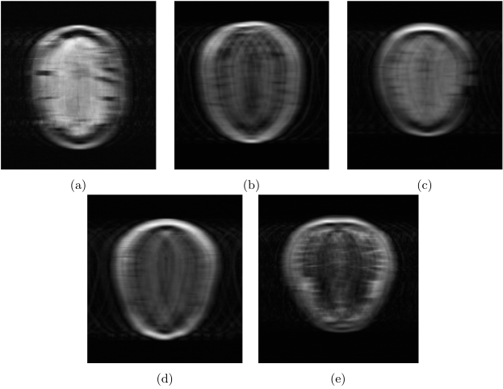

# MRI image reconstruction using fastMRI library

## fastMRI

fastMRI is colaborative exploratory project from Facebook AI Research with goal of developing faster ways of MRI image acquisition. It consists of datasets of brain and knee MRI images, and of code repository with tools to work with dataset and model implementation.

## Models in fastMRI library

### Zero-Filled

Fills unsampled k-space data with zeroes. Then it applies twodimensional IFT to it and calculates end result.

### Compressed Sensing

Compressed Sensing is based on mathematical principal which states images and signals can be represented with less data without loosing significant amount of information, as long as most of the data is zero in some domain. Implementation in fastMRI is based on ESPIRiT work.

### U-Net

<!-- U-Net model provided by fastMRI is meant to be used on reconstruction of images taken with single coil. To use it on images taken with multiple coils it's first needed to do zero-fill method on each coil image.
Model consists of two deep convolution network paths. First (left on image) is compression path and second (right on image) is decompression path. 
Compression path consists of 3x3 convolution blocks, each convolution is followed with instance normalisation and ReLU activation function. Blocks are down sampled using max-pooling with step of two.
Decompression path consists of similar blocks, but blocks are up scaled with each step.
Compression and decompression paths are connected with skip connections.
The path of compression allows capturing the context and reveals what's in the image, while the path of decompression reveals where is it located in the image. To improve localization, high-resolution features from the compression path are connected with the outputs from the up-sampling path through skip connections. With the information from the skip connections, a more precise output from the block is obtained. At the end of the up-sampling path, 1x1 convolutions are used to reduce the number of channels to one without changing the spatial resolution. To predict the edge pixels of the input image, a mirroring technique is applied to fill in the missing data. -->

The U-Net model provided by fastMRI is designed for single-coil image reconstruction, but can be adapted to multi-coil images using the zero-fill method for each coil. The model consists of two main paths: a compression path and decompression path. Compression path goal is context and content capture using 3x3 convolutions, instance normalization, ReLU activation and max-pooling down-sampling. Decompresion path is used for spatial localization and block up-scaleing. Both paths are connected with skip connections which enchance detail and precision in the output using high-resolution features.

    

### End-to-End VarNet

End-to-End Varnet model is designet do learn complete process of reconstruction. End-to-End means we can give it raw data without any preprocessing and it will give out processed result.

It takse multi coil k-space as input and applies a series of refinement steps which we call cascades. At the begginning sensitivity maps are estimated using SME module. In each cascade Data Consistency module (DC) and Refinement module (R) is applied. After cascades, IFT is performed to get image from each k-space, followed by root-sum-squares reduction (RSS) for each pixel. Image is then cropped and output is given.

#### SME module

Sensitivity Map Estimation module estimates sensitivity maps which are later used in Refinement module. In traditional VarNet sensitivity maps are computed using the ESPIRiT algorithm, but here they're computed using SME module:

<!-- $$ H = dSS \circ CNN \circ \mathcal{F}^{-1} \circ M_{\text{center}} $$ -->

    

 - Mcenter zeroes all lines except ACS lines. ACS are autocalibration lines, central region of k-space corresponding to low frequencies which is used for sensitivity estimation.
- CNN is convolutional neural network. Same as one used in cascades (U-Net), except with fewer channels and fewer parameters.
- dSS normalizes sensitivity maps. They need to satisfy equiation below:

<!-- $$ \sum_{i=1}^{N} S_i^* S_i = 1 $$ -->

    

#### DC module

Data Consistency computes correction map which brings the intermediate k-space closer to the measured k-space values. Ut performs subtraction between inputs and identifies differences between them. After that, it applies correction map to differences identifies in previous step. Adjusts intermediate k-space so it becomes more consistend with measured k-space values.

#### Refinement module

Refinement module maps multi-coil k-space data into one image. It takes intermediate k-space and esttimated sensitivity maps (ESM) as input. Applies IFT to intermediate k-space, then using ESM it reduces it to single image. It applies U-Net on image and then using ESM expands them to images seen by each coil. After all of those steps it applies FT so output is k-space.

    

## Results:

  
   
  <em>Test images</em>

  

    
      
       
      <em>Zero-fill</em>
    
    
      
       
      <em>Compressed Sensing</em>
    
  

  

    
      
       
      <em>U-Net</em>
    
    
      
       
      <em>End-to-End VarNet</em>
    
  

## Conclusion

In this project we used already trained models which fastMRI library provides. Reconstruction techniques and models which were tested are zero-fill, compressed sensing, U-Net and E2E VarNet. First, noise was added to a fully sampled image, followed by reconstructions performed on the noisy image. This was done to compare the results with the fully sampled reconstruction and thus easily discern all reconstruction characteristics. The results from U-Net and VarNet models show cleaner images, but a comparison with the original image reveals a lack of details. Then, test images from all five data collection methods were loaded, and reconstructions were performed on them. The results also show higher quality and sharper images with U-Net and VarNet models, but it is not possible to draw a complete conclusion due to the lack of comparison as in the previous example. Determining the clinical validity of the obtained results is not possible without consulting a medical diagnostics expert.

## Future

Goal is to implement modified U-Net and VarNet models and adapt them for the task of reconstructing MRI brain images. The display, explain and compare the results and determine the accuracy of the developed system.