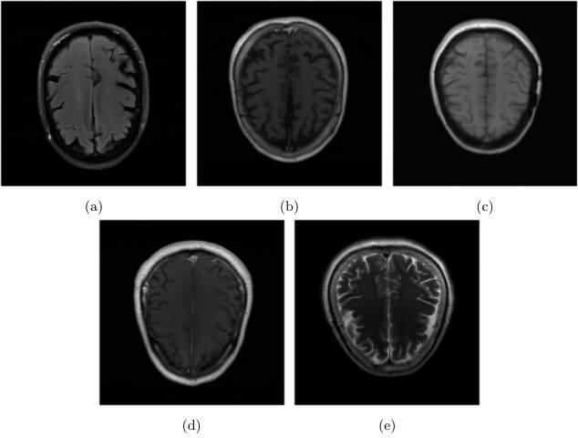

# MRI image reconstruction using fastMRI library

## fastMRI

fastMRI is colaborative exploratory project from Facebook AI Research with goal of developing faster ways of MRI image acquisition. It consists of datasets of brain and knee MRI images, and of code repository with tools to work with dataset and model implementation.

## Models in fastMRI library

### Zero-Filled

Fills unsampled k-space data with zeroes. Then it applies twodimensional IFT to it and calculates end result.

### Compressed Sensing

Compressed Sensing is based on mathematical principal which states images and signals can be represented with less data without loosing significant amount of information, as long as most of the data is zero in some domain. Implementation in fastMRI is based on ESPIRiT work.

### U-Net

<!-- U-Net model provided by fastMRI is meant to be used on reconstruction of images taken with single coil. To use it on images taken with multiple coils it's first needed to do zero-fill method on each coil image.
Model consists of two deep convolution network paths. First (left on image) is compression path and second (right on image) is decompression path. 
Compression path consists of 3x3 convolution blocks, each convolution is followed with instance normalisation and ReLU activation function. Blocks are down sampled using max-pooling with step of two.
Decompression path consists of similar blocks, but blocks are up scaled with each step.
Compression and decompression paths are connected with skip connections.
The path of compression allows capturing the context and reveals what's in the image, while the path of decompression reveals where is it located in the image. To improve localization, high-resolution features from the compression path are connected with the outputs from the up-sampling path through skip connections. With the information from the skip connections, a more precise output from the block is obtained. At the end of the up-sampling path, 1x1 convolutions are used to reduce the number of channels to one without changing the spatial resolution. To predict the edge pixels of the input image, a mirroring technique is applied to fill in the missing data. -->

The U-Net model provided by fastMRI is designed for single-coil image reconstruction, but can be adapted to multi-coil images using the zero-fill method for each coil. The model consists of two main paths: a compression path and decompression path. Compression path goal is context and content capture using 3x3 convolutions, instance normalization, ReLU activation and max-pooling down-sampling. Decompresion path is used for spatial localization and block up-scaleing. Both paths are connected with skip connections which enchance detail and precision in the output using high-resolution features.

    

### End-to-End VarNet

End-to-End Varnet model is designet do learn complete process of reconstruction. End-to-End means we can give it raw data without any preprocessing and it will give out processed result.

It takes multi coil k-space as input and it applies a series of refinement steps which we call cascades. Each cascade applies an enhancement step similar to gradient descent, but the intermedieate product is k-space, not an image.

    

## Results:

  
   
  <em>Test images</em>

  

    
      
       
      <em>Zero-fill</em>
    
    
      
       
      <em>Compressed Sensing</em>
    
  

  

    
      
       
      <em>U-Net</em>
    
    
      
       
      <em>End-to-End VarNet</em>
    
  

## Future

Goal is to implement modifies U-Net and VarNet models and adapt them for the tash of reconstructing MRI brain images. The to display, explain and compare the results and determine the accuracy of the developed system.