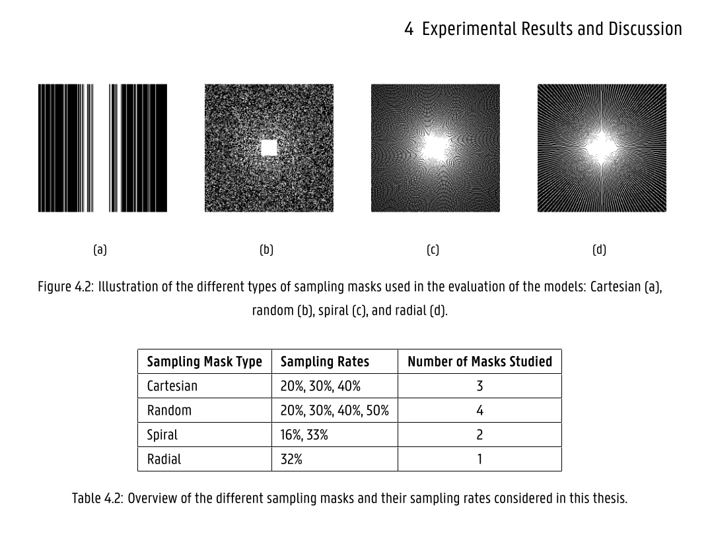

# Checkpoint - April 11th 2024

## Progress

### Masks

I've seen that Emiel used multiple types of masks in his thesis and I'll also do it like that.

### Dataset

- Downloaded and extracted IXI dataset with T1 and T2 contrasting.
- MRI images have 256 slices in 3 axis. FastMRI only has images from above and slices are above eyes. So I've extracted from each file 16 slices above eyes. Mostly from slice 140 to 255. Saved them in h5 format.
- I've also saved them in k-space format.
- Images are different dimensions:
  - fastMRI:
    - T1 - 256x320
    - T2 - 288x384
  - IXI:
    - all images are 256x256

**Problem**

- It doesn't contain multicoil data which is needed for VarNet training.
- Since we don't have multicoil data I can't use DataLoader which fastMRI provided.
  
> **Conclusion:** I can train UNet with this data, but not VarNet.

- Number of images in dataset:
  - fastMRI: (total: 6465)
    - T1: 791
    - T1 post contrast: 1495
    - T2: 4179
  - IXI: (total: 1161)
    - T1: 582
    - T2: 579

### Other

- Tea sent me today GitHub repository with tools for training with both fastMRI and IXI datasets https://github.com/yilmazkorkmaz1/SSDiffRecon

- Found new dataset: https://sites.google.com/view/calgary-campinas-dataset/download?authuser=0
  